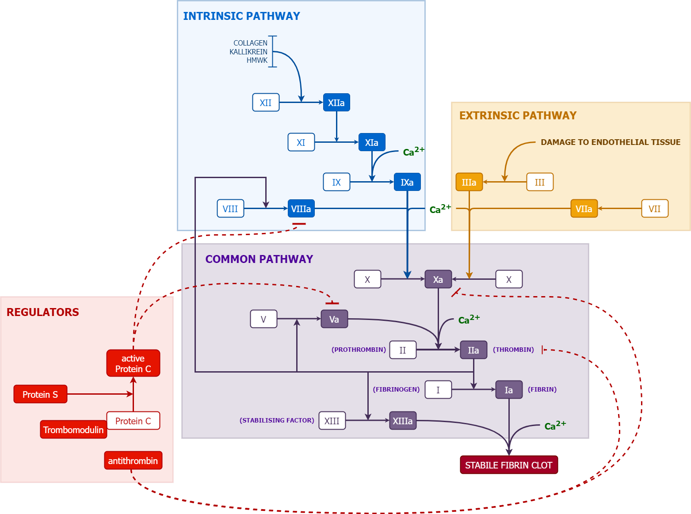

```{r setup, include=FALSE}
knitr::opts_chunk$set(echo = TRUE)
library(tidyverse)
library(DT)
library(rmdformats)
```

# Primaire hemostase 

## Hoe werkt en interpreteer ik een plaatjesfunctieanalyse (PFA-100)

](./images/PFA100.png)

### Mechanisme
De Platelet Function Analyzer-100 (PFA-100) wordt gebruikt om plaatjesfunctie te testen in volbloed. In het toestel wordt een cardridge geplaatst dat een membraan bevat en gecoat is met collageen en epinefrine of adenosine difosfaat. In dit membraan zit een kleine opening. Door bloed te laten stromen over dit membraan wordt de opening gedicht door plaatjesactivatie en -aggregatie. Uiteindelijk wordt er een stabiele klonter gevormd. De "closure time" is de tijd die nodig is om een volledige occlusie van de opening in het membraan te krijgen.
[Bron](https://pubmed.ncbi.nlm.nih.gov/9576184/)


### Interpretatie
Een verlengde closure time (CT) kan wijzen op verschillende trombopathieën (Von Willebrand, ernstige thrombocytopathieën), maar is niet specifiek voor één bepaalde aandoening en bij een afwijkende test is verder onderzoek nodig. 

# Secundaire hemostase
<!-- Dropdown menu and image viewer -->
<div>
  <label for="image-selector">Kies een probleem:</label>
  <select id="image-selector" onchange="updateImage();">
    <option value="./images/stolling.drawio.png">Overzicht</option>
    <option value="./images/vitK.drawio.png">Vitamine K afhankelijke stolfactoren</option>
    <!-- <option value="./images/PT.drawio.png">PT</option>-->
    <!-- <option value="./images/aPTT.drawio.png">aPTT</option>-->
  </select>
</div>

<!-- Where the default image or selected image will be displayed -->
<div>
  <!-- Default image initially shown -->
  
</div>

<script>
// JavaScript to update the displayed image based on dropdown selection
function updateImage() {
  var imageSelector = document.getElementById("image-selector");
  var selectedImage = imageSelector.value;
  var imageViewer = document.getElementById("image-viewer");
  imageViewer.src = selectedImage;
}
</script>

## Welke stolfactoren moet ik bepalen om vitamine K deficientie op te sporen?
Vitamine K staat in voor de hepatische synthese van factors VII, IX, X, en II (prothrombin). Daarnaast is vitamine K ook noodzakelijk voor de functie van proteine C en proteine S. [Bron](https://www.uptodate.com/contents/overview-of-vitamin-k).

### Oorzaken
Vitamine K is een vetoplosbaar vitamine en alle oorzaken van vetmalabsorptie kan leiden tot vitamine K tekort.

- Mucoviscidose
- Galwegatresie
- Cholestase 
- Intestinale aandoeningen (coeliakie, IBD, short bowel)
- Leverfalen: bij ernstig leverfalen kan bepalen van factor V en VII helpen om een onderscheid te maken tussen vitamine K deficientie en gestoorde stolling door leveraantasting. Factor V is bewaard bij vitamine K malabsorptie en factor VII is gedaald; het omgekeerde is van toepassing voor leverfalen.

### Effect op PT en aPTT
Bij vitamine K deficientie zijn zowel PT als aPTT verstoord (zie figuur). Bij milde deficientie kan enkel PT verstoord zijn door een dominant effect van factor VII, bij ernstige deficientie zijn PT en aPTT beide verstoord (zie figuur).

## Ik heb een patient onder Xarelto (rivaroxaban) waarbij ik een procedure plan, wat moet ik doen? 

Xarelto en andere directe orale anticoagulantia werken door te binden aan de actieve site van factor Xa, waardoor Xa geïnhibeerd wordt.

Xarelto heeft een halfwaardetijd van gemiddeld 4.2 uur bij adolescenten, 3 uur bij kinderen tussen 2 tot 12 jaar, 1.9 uur bij kinderen 0.5 tot <2 jaar, en 1.6 uur bij kinderen <0.5 jaar (met renale klaring dus bij nierinsufficientie neemt de halfwaardetijd toe). [Bron](https://www.ncbi.nlm.nih.gov/books/NBK557590/) en [2](https://www.xareltohcp.com/pediatric-indications/pediatric-vte/).

Bij patienten met een normale nierfunctie dient Xarelto gestopt te worden 24u op voorhand bij een procedure met laag bloedingsrisico en 48u bij een procedure met een hoog bloedingsrisico. [Bron 1]( https://www.janssenscience.com/products/xarelto/medical-content/use-of-xarelto-in-perioperative-use#references-content), [2](https://cpthn.ca/wp-content/uploads/2023/01/CPTHN-Rivaroxaban-Guidance-Document_Final-Sep-2021-002.pdf)

```{r, echo=FALSE, warning=FALSE, message=FALSE, error=FALSE}
procedures_risk <- tibble(
  `MILD/MATIG RISICO` = c(
    "Tandextracties",
    "Dermatologische procedures (bv biopsie)",
    "Endoscopie of colonoscopie (+/- biopsie)",
    "Beenmergpunctie",
    "Lumbaalpunctie",
    "Andere abdominale surgery (e.g., laparoscopische cholecystectomie, herniaherstel)",
    NA
  ),
  `HOOG RISICO` = c(
    "Neurochirurgie",
    "Neuraxiale anesthesie (spinaal or epiduraal)",
    "Hartchirurgie",
    "Majeure abdominale chirurgie",
    "Thoraxchirurgie",
    "Extensieve tumorectomie",
    "Lever of nierbiopsie"
  )
)


datatable(
  procedures_risk,
  rownames = FALSE,                     # Remove row names
  options = list(
    dom = 't',                          # Only show the table, no search or pagination
    ordering = FALSE,                   # Disable column sorting
    info = FALSE,                       # Hide table information
    paging = FALSE                      # Disable pagination
  ),
  #style = "minimal"                     # Use the minimal style
)
```
